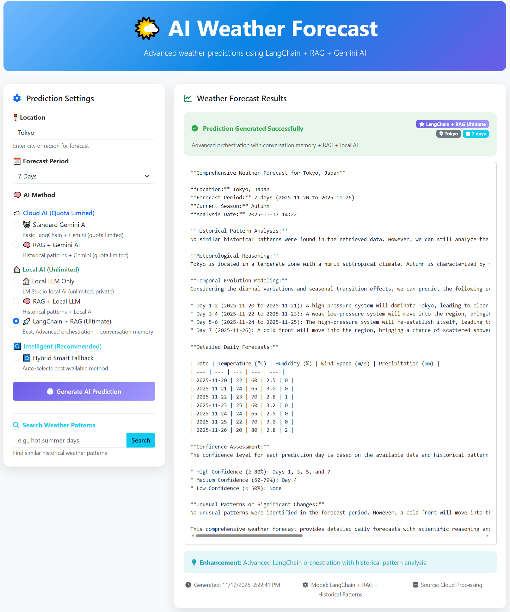

# 🌤️ Advanced Flask Weather Prediction App

A comprehensive Flask application featuring cutting-edge AI-powered weather prediction with multiple intelligence models including LangChain + RAG orchestration, local LLM integration via LM Studio, and advanced pattern recognition.



## 🚀 Overview

This application combines traditional web development with modern AI technologies to provide intelligent weather predictions. The system features:

- **🧠 Multiple AI Prediction Methods**: LangChain + RAG, Local LLM via LM Studio, Hybrid Intelligence
- **📚 RAG (Retrieval-Augmented Generation)**: Historical weather pattern retrieval from ChromaDB vector store
- **🏠 Local LLM Integration**: LM Studio API support for privacy-focused predictions
- **🔐 Complete Authentication System**: Session-based auth with CSRF protection
- **📊 Historical Data Analysis**: 274+ weather records with intelligent pattern matching
- **⚡ Real-time Predictions**: Multiple fallback methods ensuring reliability
- **🎯 Interactive Dashboard**: Modern Bootstrap 5 UI with dynamic method selection

## 🌟 Key Features

### Weather Prediction Capabilities
- **LangChain + RAG Orchestration**: Advanced chain-of-thought reasoning with historical pattern retrieval
- **Local LLM Integration**: Privacy-focused predictions using LM Studio (llama-3.2-3b-instruct)
- **RAG-Enhanced Predictions**: ChromaDB vector store with 274+ historical weather patterns
- **Hybrid Smart Fallbacks**: Intelligent degradation from AI to statistical methods
- **Statistical Analysis**: Mathematical baseline predictions as reliable fallback
- **Pattern Search**: Semantic search through historical weather data

### Technical Infrastructure
- **Session-based Authentication**: Secure login/logout with session management
- **CSRF Protection**: Built-in protection against cross-site request forgery
- **MySQL Database**: XAMPP-compatible with automatic setup scripts
- **Vector Database**: ChromaDB for efficient similarity search
- **Error Handling**: Comprehensive timeout and fallback management
- **API Architecture**: RESTful endpoints with detailed status reporting

### User Experience
- **Modern UI**: Bootstrap 5 responsive design
- **Method Selection**: Interactive dropdown for choosing prediction approach
- **Real-time Feedback**: Loading indicators and status updates
- **Detailed Results**: Confidence levels and method explanations
- **Error Guidance**: Helpful messages for timeout and service issues

## 📋 Prerequisites

### XAMPP Setup (MySQL Database)
1. **Download and install XAMPP** from [https://www.apachefriends.org/](https://www.apachefriends.org/)
2. **Start XAMPP Control Panel** as Administrator
3. **Start Apache and MySQL services** in XAMPP Control Panel
4. **Verify MySQL is running** - you should see "Running" status in green

### LM Studio Setup (Optional - for Local LLM)
1. **Download LM Studio** from [https://lmstudio.ai/](https://lmstudio.ai/)
2. **Install a compatible model** (recommended: llama-3.2-3b-instruct)
3. **Start the Local Server** in LM Studio
4. **Configure API endpoint** at `http://127.0.0.1:1239` (default)

### Google AI API (Optional - for Gemini AI)
1. **Get API Key** from [Google AI Studio](https://makersuite.google.com/app/apikey)
2. **Create .env file** and add: `GEMINI_API_KEY=your_api_key_here`
3. **Enhanced predictions** will use Gemini for advanced reasoning

### Database Setup
**Automatic Setup** (Recommended):
```bash
# Install Python dependencies
pip install -r requirements.txt

# Run automatic database setup
python setup_database.py
```

**Manual Setup** (Alternative):
1. Open phpMyAdmin (click "Admin" button next to MySQL in XAMPP)
2. Create database `flask_react_app`
3. Tables will be created automatically on first run

The setup script will:
- Create the database `flask_react_app` automatically
- Initialize all required tables
- Test MySQL connection
- Load weather data (274+ historical records)
- Initialize vector store for RAG
- Provide troubleshooting tips if issues occur

## 🏗️ Architecture & Project Structure

```
📁 Flask-Weather-Prediction-App/
├── 🐍 app.py                      # Main Flask application
├── ⚙️ .env                       # Configuration (create from template)
├── 🗃️ setup_database.py          # Automated MySQL setup
├── 📋 requirements.txt            # Python dependencies
├── 📊 data/                      # Weather datasets
│   └── Generated_electricity_load_japan_past365days.csv
├── 🔧 backend/                   # Backend services
│   ├── 🌐 routes.py              # API endpoints (20+ weather endpoints)
│   ├── 🔐 auth.py                # Authentication system
│   ├── 🗂️ models.py             # Database models
│   ├── 🌤️ weather_service.py     # Core weather prediction logic
│   ├── 🧠 langchain_rag_service.py # LangChain + RAG orchestration
│   ├── 🏠 lmstudio_service.py    # Local LLM integration
│   └── 📚 rag_service.py         # Vector database RAG
├── 🎨 frontend/                  # Web interface
│   ├── 📄 templates/            # Jinja2 templates
│   │   ├── 🏠 base.html         # Base template
│   │   ├── 🔑 login.html        # Authentication
│   │   ├── 📊 dashboard.html     # User dashboard
│   │   └── 🌤️ weather_dashboard.html # Weather prediction UI
│   └── 🎯 static/              # CSS/JS assets
│       ├── css/main.css         # Styling
│       └── js/main.js          # Frontend logic
└── 🗄️ flasking/                # Virtual environment
```

## 🛠️ Tech Stack

### Backend Technologies
- **🐍 Flask 3.1.1**: Modern Python web framework
- **🗄️ Flask-SQLAlchemy**: Object-Relational Mapping
- **🔐 Flask-JWT-Extended**: Token-based authentication
- **🛡️ Flask-WTF**: CSRF protection and forms
- **🌐 Flask-CORS**: Cross-origin resource sharing
- **💾 MySQL + PyMySQL**: Database with XAMPP support

### AI & Machine Learning
- **🧠 LangChain**: Advanced LLM orchestration framework
- **📚 ChromaDB**: Vector database for RAG operations
- **🤖 Google Generative AI**: Cloud-based intelligence
- **🏠 LM Studio API**: Local LLM integration
- **🔍 Sentence Transformers**: Embeddings for semantic search
- **📊 Pandas + NumPy**: Data processing and analysis

### Frontend Technologies
- **🎨 Bootstrap 5**: Modern responsive framework
- **⚡ Jinja2**: Server-side templating
- **📱 FontAwesome**: Professional icons
- **🎯 JavaScript ES6+**: Interactive functionality

### Infrastructure
- **🐳 ChromaDB**: Vector storage for pattern matching
- **🏠 XAMPP**: Local MySQL development
- **🔧 Python-dotenv**: Environment configuration
- **📝 Logging**: Comprehensive debug information

## 🚀 Quick Start Guide

### 1️⃣ Environment Setup
```bash
# Clone the repository
git clone <repository-url>
cd Flask-Weather-Prediction-App

# Create virtual environment (optional but recommended)
python -m venv flasking
source flasking/bin/activate  # On Windows: flasking\Scripts\activate

# Install all dependencies
pip install -r requirements.txt
```

### 2️⃣ Database Initialization
```bash
# Automatic setup (recommended)
python setup_database.py

# This will:
# ✅ Create MySQL database 'flask_react_app'
# ✅ Initialize user and weather tables
# ✅ Load 274+ historical weather records
# ✅ Setup ChromaDB vector store
# ✅ Test all connections
```

### 3️⃣ Configuration (Optional)
Create `.env` file for enhanced features:
```env
# Database (auto-configured for XAMPP)
DB_HOST=localhost
DB_PORT=3306
DB_NAME=flask_react_app
DB_USER=root
DB_PASSWORD=

# API Keys (optional)
GEMINI_API_KEY=your_google_api_key_here

# Local LLM (auto-detected)
LM_STUDIO_API_URL=http://127.0.0.1:1239
```

### 4️⃣ Launch Application
```bash
# Start Flask server
python app.py

# Server will be available at:
# 🌐 http://localhost:5000
# 🔑 Auth: http://localhost:5000/auth/login
# 🌤️ Weather: http://localhost:5000/auth/weather
```

### 5️⃣ Access Weather Dashboard
1. **Register/Login** at `http://localhost:5000/auth/signup`
2. **Navigate to Weather Dashboard** (automatically available after login)
3. **Select Prediction Method**:
   - **LangChain + RAG**: Ultimate AI with historical patterns
   - **RAG + Local LLM**: Local AI with pattern matching
   - **Local LLM Only**: Privacy-focused predictions
   - **Statistical Analysis**: Mathematical baseline

## 🌤️ Weather Prediction Methods

### 🧠 LangChain + RAG (Ultimate AI)
- **Advanced Orchestration**: Multi-step reasoning with conversation memory
- **Historical Patterns**: Retrieves similar conditions from 274+ weather records
- **Confidence Assessment**: Built-in prediction reliability scoring
- **Smart Fallbacks**: Graceful degradation if services unavailable

**Best for**: Most accurate predictions with detailed reasoning

### 🏠 Local LLM via LM Studio
- **Complete Privacy**: All processing happens locally
- **No API Limits**: Unlimited predictions without quotas
- **Customizable Models**: Support for various LLM models
- **Fast Response**: No network latency for predictions

**Best for**: Privacy-conscious users with local LM Studio setup

### 📚 RAG-Enhanced Predictions
- **Pattern Matching**: Semantic search through historical data
- **Contextual Awareness**: Understands seasonal and geographical patterns
- **Data-Driven**: Leverages real weather observations
- **Vector Similarity**: ChromaDB for efficient pattern retrieval

**Best for**: Data-driven predictions with historical context

### 📊 Statistical Analysis
- **Mathematical Baseline**: Reliable predictions using statistical methods
- **Trend Analysis**: Temperature, humidity, and wind patterns
- **Seasonal Awareness**: Accounts for seasonal variations
- **Always Available**: No external dependencies

**Best for**: Reliable baseline when AI services unavailable

## 🛡️ Security & Authentication

### Session-Based Authentication
- **Secure Login/Logout**: Session management with Flask-Login
- **CSRF Protection**: Built-in protection against cross-site attacks
- **Password Security**: Bcrypt hashing for password storage
- **Route Protection**: Authentication required for weather features

### API Security
- **Request Validation**: Input sanitization and validation
- **Error Handling**: Secure error messages without information leakage
- **Session Timeouts**: Automatic logout for inactive sessions
- **CORS Configuration**: Controlled cross-origin access

## 📊 API Endpoints

### Authentication Endpoints
| Method | Endpoint | Description |
|--------|----------|-------------|
| GET | `/auth/login` | Login page |
| POST | `/auth/login` | Process login |
| GET | `/auth/signup` | Registration page |
| POST | `/auth/signup` | Process registration |
| GET | `/auth/logout` | Logout user |
| GET | `/auth/dashboard` | User dashboard |
| GET | `/auth/weather` | Weather prediction interface |

### Weather Prediction API
| Method | Endpoint | Description |
|--------|----------|-------------|
| POST | `/api/weather/predict` | Standard AI prediction |
| POST | `/api/weather/predict-rag` | RAG-enhanced prediction |
| POST | `/api/weather/predict-local` | Local LLM prediction |
| POST | `/api/weather/predict-rag-local` | RAG + Local LLM |
| POST | `/api/weather/predict-hybrid` | Hybrid smart fallback |
| POST | `/api/weather/predict-langchain-rag` | **Ultimate LangChain + RAG** |

### Data & Analysis API
| Method | Endpoint | Description |
|--------|----------|-------------|
| POST | `/api/weather/rag-search` | Search weather patterns |
| GET | `/api/weather/rag-stats` | RAG service statistics |
| GET | `/api/weather/data-summary` | Weather data overview |
| GET | `/api/weather/recent-data` | Recent weather observations |

### Service Status API
| Method | Endpoint | Description |
|--------|----------|-------------|
| GET | `/api/weather/lm-studio-status` | LM Studio availability |
| GET | `/api/weather/langchain-rag-status` | LangChain service status |
| GET | `/api/health` | Overall system health |

## 🔧 Advanced Configuration

### LM Studio Setup
```bash
# 1. Download LM Studio from https://lmstudio.ai/
# 2. Download a compatible model (recommended):
#    - llama-3.2-3b-instruct (3GB, fast, good quality)
#    - mistral-7b-instruct (7GB, excellent quality)
# 3. Start Local Server in LM Studio
# 4. Verify endpoint: http://127.0.0.1:1239
# 5. App will auto-detect and enable local features
```

### Google AI Integration
```bash
# 1. Get API key from Google AI Studio
# 2. Add to .env file: GEMINI_API_KEY=your_key
# 3. Restart application
# 4. Enhanced predictions with Gemini Pro will be available
```

### Vector Database Optimization
```bash
# Reset vector store (if needed)
python -c "
import shutil
shutil.rmtree('./chromadb_store', ignore_errors=True)
python setup_database.py  # Rebuilds vector store
"

# The ChromaDB store contains:
# ✅ 274+ weather observations
# ✅ Semantic embeddings for pattern matching
# ✅ Metadata for filtering (season, location, etc.)
```

## 🚨 Troubleshooting Guide

### MySQL Connection Issues
```bash
# Check XAMPP MySQL status
# ❌ XAMPP not running: Start MySQL service in XAMPP Control Panel
# ❌ Port 3306 busy: Check if another MySQL service is running
# ❌ Access denied: Verify credentials in .env file
# ❌ Database doesn't exist: Run python setup_database.py

# Test connection manually
python -c "
import pymysql
try:
    conn = pymysql.connect(host='localhost', user='root', password='')
    print('✅ MySQL connection successful')
    conn.close()
except Exception as e:
    print(f'❌ MySQL connection failed: {e}')
"
```

### LM Studio Issues
```bash
# ❌ LM Studio not detected
# 1. Ensure LM Studio is running
# 2. Start Local Server in LM Studio
# 3. Check endpoint: http://127.0.0.1:1239/v1/models
# 4. Load a compatible model (llama-3.2-3b-instruct recommended)

# Test LM Studio connectivity
curl http://127.0.0.1:1239/v1/models

# Should return JSON with available models
```

### AI Service Issues
```bash
# ❌ "Service not available" errors
# 1. Check Google AI API key in .env file
# 2. Verify internet connection for cloud AI
# 3. Ensure LM Studio is running for local AI
# 4. Application will fallback to statistical methods

# ❌ ChromaDB/RAG errors
python setup_database.py  # Rebuilds vector store
```

### Common Fixes
```bash
# Reset everything (nuclear option)
# 1. Stop Flask application
# 2. Delete chromadb_store/ directory
# 3. Drop flask_react_app database in phpMyAdmin
# 4. Run: python setup_database.py
# 5. Run: python app.py

# Reinstall dependencies
pip install -r requirements.txt --force-reinstall --no-cache-dir

# Check logs for detailed error information
# Logs are printed to console with detailed service status
```

## 🎯 Development & Testing

### Running Tests
```bash
# Test individual services
python test_weather_service.py    # Weather prediction service
python test_lm_studio.py         # LM Studio connectivity

# Manual API testing
curl -X POST http://localhost:5000/api/weather/predict-langchain-rag \
  -H "Content-Type: application/json" \
  -d '{"location": "Tokyo", "timeframe": 3}' \
  -b "session=test"
```

### Development Mode
```bash
# Enable Flask debug mode
export FLASK_ENV=development  # Linux/Mac
set FLASK_ENV=development     # Windows

# Debug logging
export FLASK_DEBUG=1
python app.py  # Will show detailed debug information
```

### Adding New Features
```bash
# Backend development
# 1. Add routes in backend/routes.py
# 2. Add services in backend/weather_service.py
# 3. Update models in backend/models.py if needed

# Frontend development
# 1. Update templates in frontend/templates/
# 2. Add styling in frontend/static/css/
# 3. Add JavaScript in frontend/static/js/
```

## 🔮 Future Roadmap

### Planned Features
- **🌍 Multi-location Support**: Global weather predictions
- **📅 Extended Forecasts**: 14-day predictions with uncertainty bands
- **🎨 Visualization**: Interactive charts and weather maps
- **📱 Mobile App**: React Native companion app
- **🔔 Alerts**: Custom weather alerts and notifications
- **📈 Analytics**: User prediction accuracy tracking
- **🌐 API Gateway**: Public API for third-party integration

### AI Enhancements
- **🧠 Model Fine-tuning**: Custom weather prediction models
- **📊 Ensemble Methods**: Combining multiple AI approaches
- **🔍 Real-time Data**: Live weather data integration
- **🎯 Location-specific Models**: Regional weather pattern learning
- **📝 Natural Language**: Conversational weather queries

## 📜 License & Contributing

### License
This project is licensed under the MIT License. See LICENSE file for details.

### Contributing
1. Fork the repository
2. Create a feature branch (`git checkout -b feature/amazing-feature`)
3. Commit your changes (`git commit -m 'Add amazing feature'`)
4. Push to the branch (`git push origin feature/amazing-feature`)
5. Open a Pull Request

### Development Guidelines
- Follow PEP 8 for Python code
- Add type hints for new functions
- Include comprehensive logging
- Write tests for new features
- Update documentation for API changes

## 🤝 Support & Community

### Getting Help
- **📚 Documentation**: Check this README for detailed information
- **🐛 Issues**: Report bugs via GitHub Issues
- **💬 Discussions**: Join GitHub Discussions for questions
- **📧 Contact**: Reach out for collaboration opportunities

### Acknowledgments
- **LangChain**: For powerful LLM orchestration framework
- **LM Studio**: For local LLM hosting capabilities
- **ChromaDB**: For efficient vector storage
- **Google AI**: For Gemini API integration
- **Flask Community**: For excellent web framework
- **Bootstrap**: For responsive UI components

---

**Made with ❤️ using Flask, LangChain, and AI technologies**

*Experience the future of weather prediction with multiple AI approaches, local privacy, and intelligent fallbacks.*
